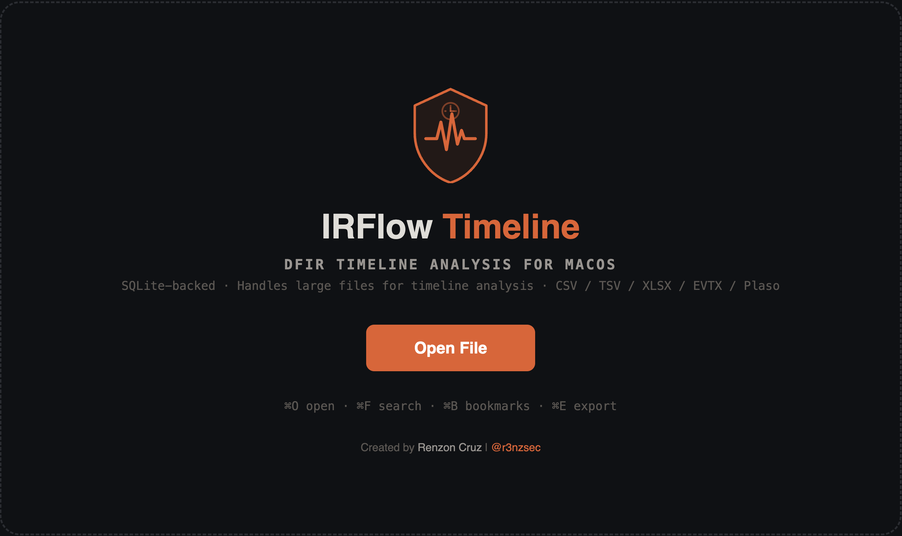

# IRFlow Timeline


A high-performance native macOS application for DFIR timeline analysis. Built on Electron + SQLite to handle large files for forensic timelines (CSV, TSV, XLSX, EVTX, Plaso) without breaking a sweat.

Inspired by Eric Zimmerman's Timeline Explorer for Windows.

For features, getting started, and documentation, visit the **[IRFlow Timeline Docs](https://r3nzsec.github.io/irflow-timeline/)**.

## Building from Source

**Prerequisites (for developers only):**
- Node.js 18+: `brew install node`
- Xcode CLI tools: `xcode-select --install` (for native module compilation)
- macOS 11+ (Big Sur or later)

```bash
git clone https://github.com/r3nzsec/irflow-timeline.git
cd irflow-timeline
npm install
npx electron-rebuild -f -w better-sqlite3

# Development (hot-reload)
npm run dev

# Build + launch
npm run start

# Package as universal DMG
npm run dist:universal
```

Output in `release/`.

## Credits & Acknowledgments

Inspired by [Eric Zimmerman's Timeline Explorer](https://ericzimmerman.github.io/).

### Open Source Projects

| Project | Usage | Link |
|---------|-------|------|
| **Electron** | Application framework | [electron/electron](https://github.com/electron/electron) |
| **better-sqlite3** | High-performance SQLite engine with WAL mode, FTS5 | [WiseLibs/better-sqlite3](https://github.com/WiseLibs/better-sqlite3) |
| **@ts-evtx/core** | Native Windows EVTX event log parsing | [NickSmet/ts-evtx](https://github.com/NickSmet/ts-evtx) |
| **Plaso (log2timeline)** | Forensic timeline generation (we import Plaso SQLite output) | [log2timeline/plaso](https://github.com/log2timeline/plaso) |
| **ExcelJS** | XLSX streaming reader | [exceljs/exceljs](https://github.com/exceljs/exceljs) |
| **SheetJS (xlsx)** | XLSX parsing | [SheetJS/sheetjs](https://github.com/SheetJS/sheetjs) |
| **csv-parser** | CSV/TSV streaming parser | [mafintosh/csv-parser](https://github.com/mafintosh/csv-parser) |
| **React** | UI rendering | [facebook/react](https://github.com/facebook/react) |
| **Vite** | Build tooling and hot-reload | [vitejs/vite](https://github.com/vitejs/vite) |
| **VitePress** | Documentation site | [vuejs/vitepress](https://github.com/vuejs/vitepress) |
| **electron-builder** | macOS DMG packaging | [electron-userland/electron-builder](https://github.com/electron-userland/electron-builder) |

### DFIR Community

- [Eric Zimmerman](https://ericzimmerman.github.io/) -- Timeline Explorer for Windows, the original inspiration for this project
- [log2timeline/Plaso](https://github.com/log2timeline/plaso) -- Super timeline generation framework by Kristinn Gudjonsson and contributors
- [SANS DFIR](https://www.sans.org/digital-forensics-incident-response/) -- DFIR training and community resources
- [The DFIR Report](https://thedfirreport.com/) -- Real-world intrusion analysis reports that informed threat detection patterns

### Beta Testers

Thanks to the following people for testing and providing feedback:

- [Maddy Keller](https://www.linkedin.com/in/madeleinekeller98/)
- [Omar Jbari](https://www.linkedin.com/in/jbariomar/)
- [Nicolas Bareil](https://www.linkedin.com/in/nbareil/)
- [Dominic Rathmann](https://www.linkedin.com/in/dominic-rathmann-77664323b/)
- [Chip Riley](https://www.linkedin.com/in/criley4640/)

## License

MIT
